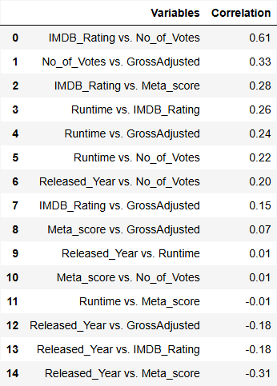
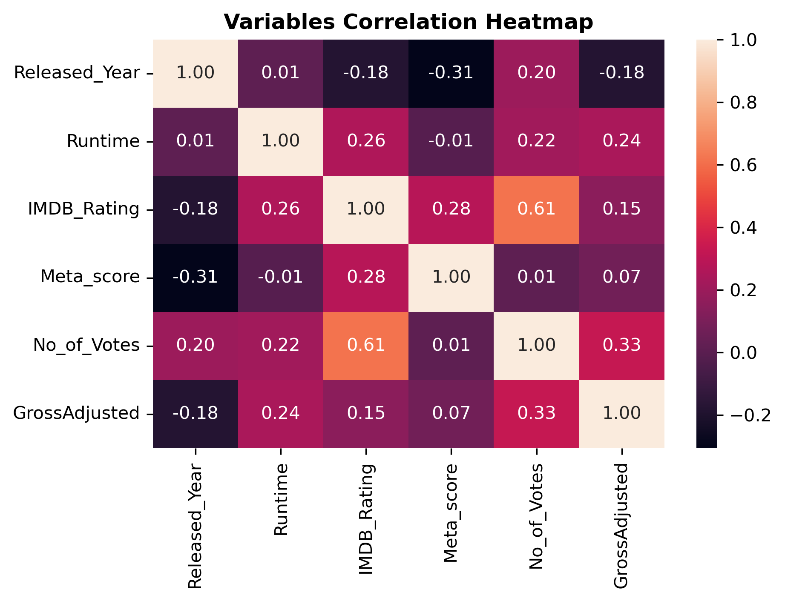
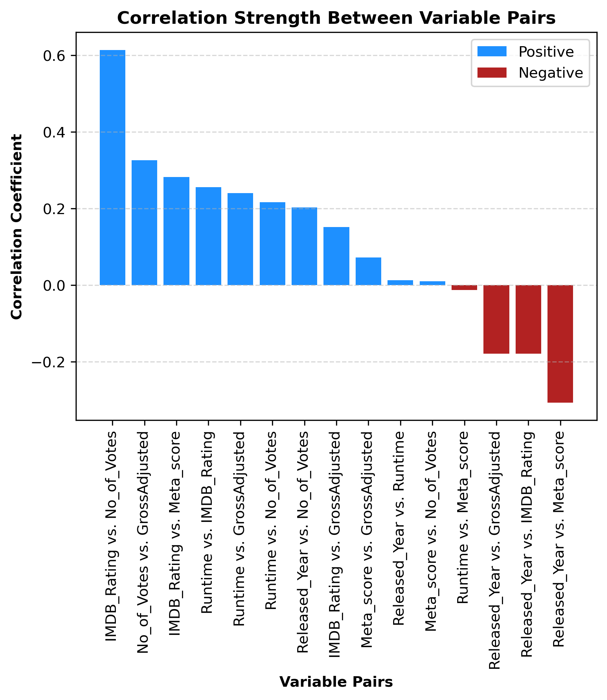
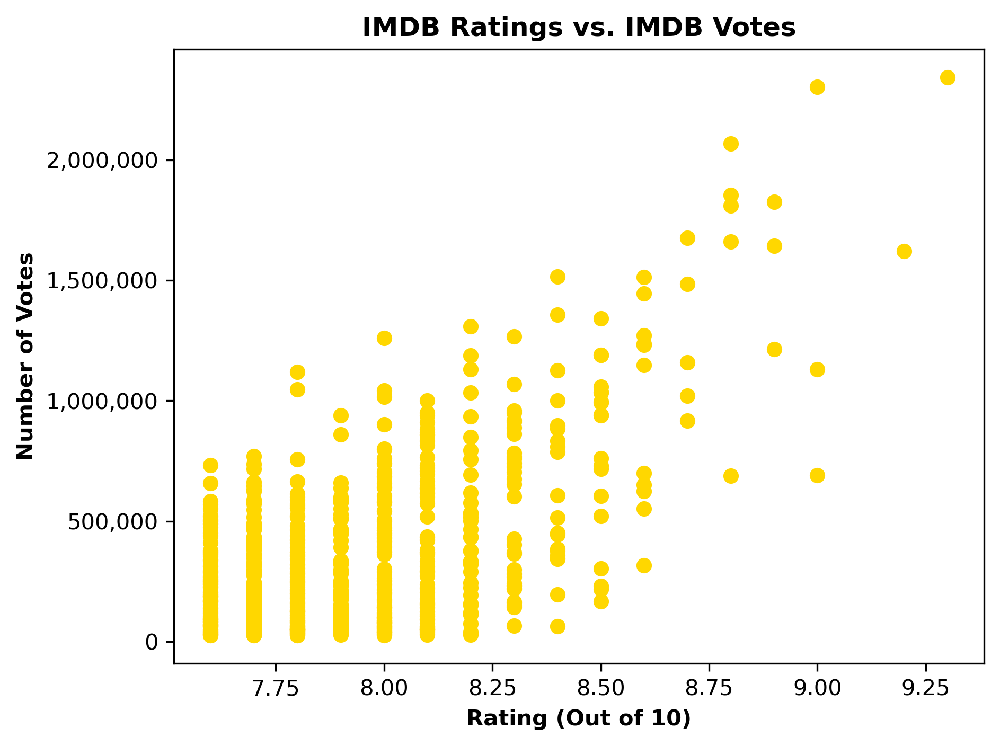
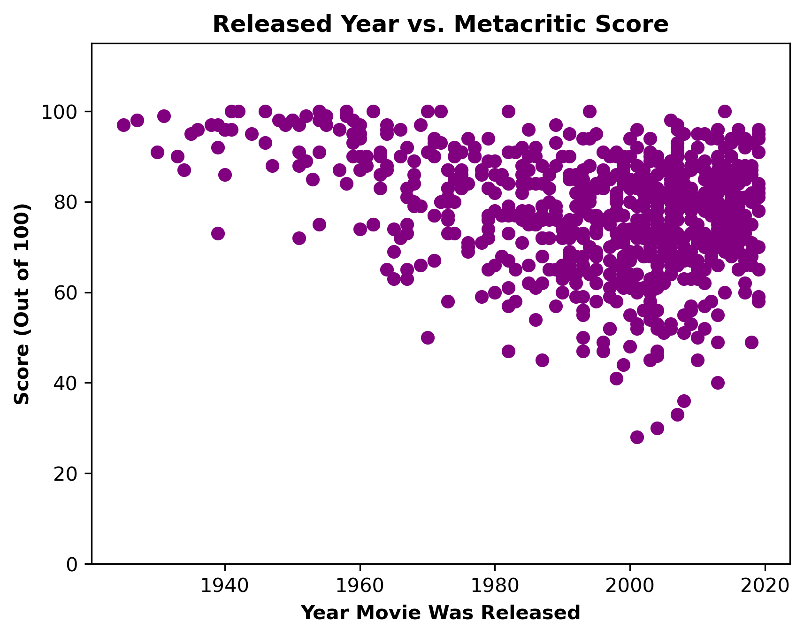
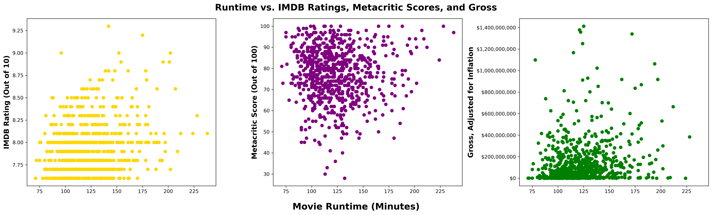
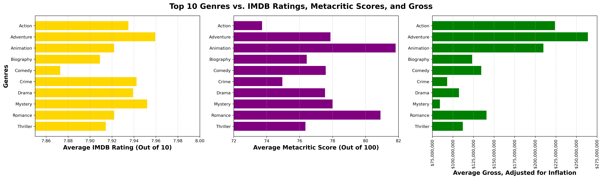
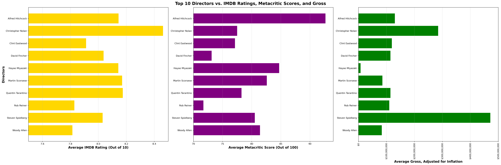
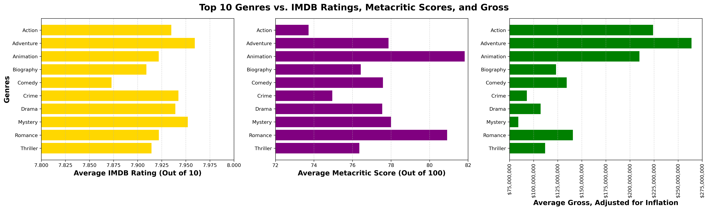

# IMDB Top 1000 Movie Rankings Explored

## Project Overview

This EDA focuses on a dataset of IMDB's Top 1000 Movie rankings.

The analysis first takes a brief look at the entire dataset of 1000 movie entries. Then, it shifts its focus onto the top performing movies based on category.

## Objective Questions

This analysis set out to answer two scopes of questions -- one broad and one narrow.

### About General Correlations

- Are there any correlations present between the various kinds of information regarding a popular box office movie?
- If so, what do these correlations look like, i.e. how strong are these correlations? Which factors influence others?

### Specific Viewership Relations
- Are there differences between how the general population rate movies and how critics score movies?
- Is the gross of a movie affected by either kinds of reception?

## Data Set and Manipulation
### Original Source

The dataset used is the [IMDB Movies Dataset hosted on Kaggle](https://www.kaggle.com/datasets/harshitshankhdhar/imdb-dataset-of-top-1000-movies-and-tv-shows).

It contains information from the top 1000 rated movies from IMDB in CSV format.

### Starting Information

For each movie, the original dataset's columns contained the following information:

- A hyperlink to a **poster** of the movie
- **Title** of the movie
- **Year** the movie was released
- Country-specific **certificates**
- **Runtime**, length of the movie, in hours and minutes
- The movie's **genre(s)** (1)
- **IMDB rating**, an average rating out of 10 that is open to the general audience via the IMDB website
- **Overview**, the synopsis of the movie
- **Metacritic score**, an average score system out of 100 that is available only to professional movie critics
- **Director** of the movie
- **Starring** actors and actresses (4)
- Number of **IMDB rating votes**
- **Gross** of the movie when it was released

### Trimmed Down

To make a comparison possible, unnecessary data columns and rows with missing values were removed, while necessary columns were type-converted and consolidated:

- **Title**, e.g. "The Dark Knight"
- **Year**, "2008" `(converted from string to integer)`
- **Runtime**, "152" `(now in minutes)`
- **Genre**, "Action, Crime, Drama" `(split per genre)`
- **IMDB rating** "9.00"
- **Metacritic score**, "84.00"
- **Director**, "Christopher Nolan"
- **Stars**, "Christian Bale, Heath Ledger, ..." `(split per star)`
- **IMDB votes**, "2303232"
- **Gross**, "642923201.61" `(adjusted for inflation via average CPI formula)`

The resulting dataset contained a mix of numeric data columns, and non-numeric string columns.

This allowed making generalized statements about the dataset based on quantitative value-based comparisons, as well as specific statements regarding relations between the qualitative categories.

## Contextual Visualization
### Correlational Heatmap
To glean any big-picture information, the correlation coefficient `(r)` was obtained for the numeric data columns:

A correlational heatmap was generated:

Bar graph of the strength of correlation coefficients:

Findings showed only one (moderately) strong correlation, and that the top correlations in both positive and negative directions (`0.61` and `-0.31`) stood out from the rest of the correlation distribution.

This means that there aren't any definitive statements we can make about the movies in the dataset, apart from the two.

### The Two Most Notable General Trends

The following scatter plots allowed a closer look at the top two strongest and most significant correlations:
1. **IMDB Ratings** vs. **IMDB Votes**: `r` of `0.61`

The upper end of higher voted movies tended to have increasing amount of IMDB votes.

In regards to the dataset, this means that more popular and highly-regarded movies were voted on much more, creating a strong consensus of a movie's quality in the eyes of the general public.

2. **Released Year** vs. **Metacritic Score**: `r` of `-0.31`

The earlier release years tended to have higher Metacritic scores in comparison to more recent titles.

This means that critics tend to value older movies (within the dataset) as being in higher quality, demonstrating a likelihood for retrospection bias.

### Any Other Patterns to Discern?

Due to the lack of strong correlations between most of the variable pairs, a multi-variable analysis was ran with a movie's **Runtime** compared against its **IMDB rating**, **Metacritic score**, and **Gross**.

While there may be a clustering in all graphs, there is no strong directionality; it is weak or near-nonexistent.

Mathematically it aligns: a movie's **runtime** did not greatly affect the **IMDB rating** (`0.26`), nor the **Metacritic score** (`-0.01`), nor the **gross** of a movie (`0.24`).

## Specific Visualization

Because only a single strong correlation correlation could be determined from the data set, numeric data was measured against each other using a common non-numeric column.

Each non-numeric columns was picked to serve as the independent variable: **genre**, **director**, and **star**, with numeric dependent variables: **IMDB rating**, **Metacritic score**, and **gross**.

Each non-numeric columns was sorted and grouped by the top 10 performing categories, to include the top 10 rated genres, top 10 rated directors, and top 10 rated stars.

### "Which Genre Is This Movie?"

As evidenced by the bar graphs, the general population and the movie critics do not agree on their perceived quality of a movie.

There is a noticeable divergence between their perception of **Action** and **Comedy** genres. **Adventure** and **Action** movies appear to be the safest bet for perceived movie quality and box office profits.

### "Who Is the Director?"

This figure of bar graphs illustrates again that opinions of popular audience and critics do not align.

There are notable differences between how each group perceive the works of **Christopher Nolan**, **David Fincher**, **Quentin Tarantino**, and **Rob Reiner**, whereas there is overlap for the works of **Hayao Miyazaki** and **Martin Scorsese**.

**Steven Spielberg** did not top the ratings of either viewership groups but had the highest-grossing films, while **Hayao Miyazaki**'s films grossed far less than those of other directors despite his ratings and scores placement.

### "Starring Who?"

This last bar graph set shows notable divergences between the general population and critical experts.

The ratings for **Brad Pitt**, **Christian Bale**, and **Leonardo DiCaprio** were higher than their respective scores, whereas ratings for **Ethan Hawke**, **Matt Damon**, **Scarlett Johansson**, and **Tom Hanks** were comparatively much lower than their scores.

The adjusted gross of the stars' films match more closely with their ratings than their scores, but for not all cases, as seen with **Tom Hanks**.

## Key Takeaways
The results of this project show:
-  **IMDB ratings** vs. **number of IMDB votes**: The more popular and highly regarded a movie is, the greater the general audience awareness and viewership (assuming vote quantity demonstrates such).
- **Released Year** vs. **Metacritic scores**: The older the movie (in this dataset), the likelier it is of having a higher critic score.
- **General audience** vs. **Critics**: There is no consensus between the general movie-watching population and professional critics when it comes to the genre, director, and stars of a movie.
- **Gross** vs. **IMDB ratings** and **Metacritic scores**: In regards to a movie's genre, director, and stars, there was no definitive relationship between those and a movie's gross.

While not particularly surprising or novel conclusions, this establishes further the common-sense notion that a top-rated movie must do very well and receive a lot of viewership in the recent movie industry market, and that audience reception of a movie may differ between general population and professional critics.

## Future Areas of Research

### Age and Target Audience

Due to the origin of the dataset, the **Certificate** column was discarded. However, a US-based movie maturity rating system (not to be confused with the IMDB ratings) could be another non-numeric axis of comparison. This could then be used to extrapolate if movies targeted to certain segments of the population, on top of **genre** as a weak marker for whom the movie is made for and marketed towards.

### A More Complete Financial Analysis
A movie's **Budget** could be compared with its **Gross** and a **Net Profit** could provide much clearer insight into a movie's financial performance, which then could be compared to the ratings- and scores-based analysis done in this project. Here, only **Gross** was available to approximate a movie's financial performance.